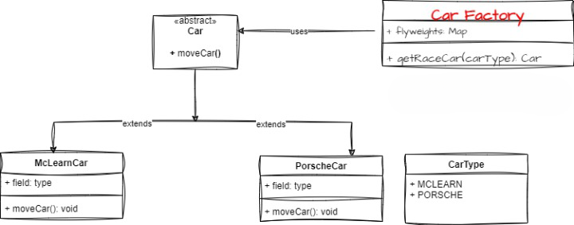

Intent
------
*is a behavioral design pattern that lets you fit more objects into the available amount of RAM
by sharing common parts of state between multiple objects instead of keeping all the data in each object*

[FlyWeightExample](https://github.com/ashharr/Design-Patterns/tree/master/src/main/java/com/example/designpatterns/structural/flyweight)

A flyweight is a shared object that can be used in multiple contexts simultaneously.
The flyweight acts as an independent object in each context—it's indistinguishable from an instance of the object that's not shared.
Flyweights cannot make assumptions about the context in which they operate.

This allows for a reduction in memory usage and improved overall performance.

The key concept here is the distinction between intrinsic and extrinsic state.
1. Intrinsic state refers to the information that is stored within the shared object, which is common to all objects that use the shared object. This information is usually immutable, meaning it cannot be changed, and is usually shared among many objects to reduce memory usage.

2. Extrinsic state, on the other hand, refers to the information that is unique to each individual object and cannot be shared among objects. This information is stored outside of the shared object and is passed as arguments to methods on the shared object when needed.

3. In other words, intrinsic state is the information that is stored in the shared object and is common to all objects that use it, while extrinsic state is the information that is unique to each individual object and is stored outside of the shared object.

4. By separating the object's state into intrinsic and extrinsic state, the Flyweight Design Pattern allows for a reduction in memory usage and improved performance, as the intrinsic state is shared among multiple objects, while the extrinsic state is stored only once for each individual object.

Implementation:
--------------
In Flyweight pattern we use a `**HashMap** |(or Any Data Set Which serves as Cache)` that stores reference to the object which have already been created,
every object is associated with a key. Now when a client wants to create an object, he simply has to pass a key associated with it and
if the object has already been created we simply get the reference to that object else it creates a new object and then returns it reference to the client.