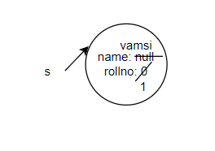

## Need Of Constructor

```JAVA
    class Student {
    String name;
    int rollno;
    

    /* constructor */
    Student(String name , int rollno){
    this.name = name;
    this.rollno = rollno;
    }

    public static void main(String[] args){
    Student s = new Student();
    Student s1 = new Student();

    }
    }
    
```    

* So if we create objects , a separate copy will be created.


* Constructor is used to initialize an object
* ClassName objname =new Constructor();

      Student s = new Student ("ashhar" ,1);



## Rules
* Constructor name should be equal to class name.
* It doesn't have any return type. because you are not calling the constructor , if you are calling you can expect something, here JVM will execute automatically.
* Access modifiers supported are public,default,protected,private.


## Types of Constructors:
**Default constructor**

      class Test{
      //Default constructor
      }
* If you don't add constructor in the class , compiler will add it.
* Every class in java, including abstract class will have constructor.
* If you are writing atleast one constructor, compiler will not generate default constructor.

prototype of default constructor:
1. It is always no-arg constructor
2. Access modifiers applicable - public , default.
3. It is a no-arg to super class constructor.

**No-Arg constructor**

     class Student {
     String name;
     int rollno;

    /* constructor */
    Student(){
    
    }

**Parameterized constructor**

      class Student {
      String name;
      int rollno;

    /* constructor */
    Student(String name , int rollno){
    this.name = name;
    this.rollno = rollno;
    }
    }